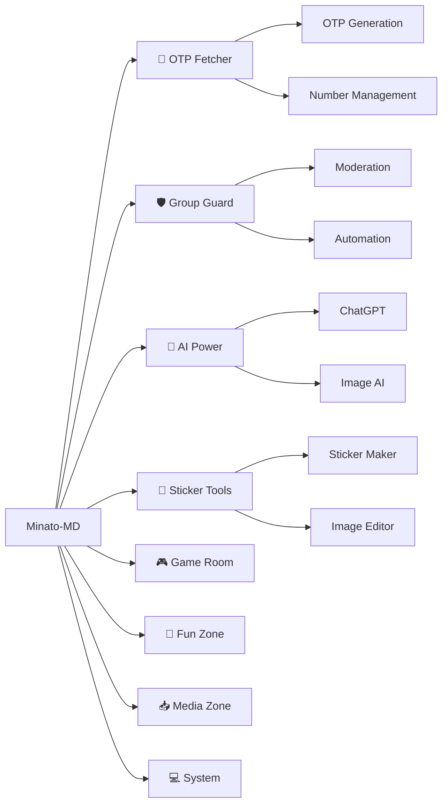

Minato-MD 🤖

"Minato-MD is not just a bot, it's an experience." ✨

<div align="center">

  

  <br>

  <div style="margin: 20px 0;">
    
  </div>

</div>

📖 About The Bot

Minato-MD is a cutting-edge WhatsApp bot that combines powerful functionality with an elegant user experience. Built with modern JavaScript technologies and maintained with passion, this bot offers an extensive collection of features designed to enhance your WhatsApp experience.

<div align="center">

https://img.shields.io/badge/Features-150%2B-blue?style=for-the-badge&logo=whatsapp&logoColor=white
https://img.shields.io/badge/Version-2.0.5-green?style=for-the-badge&logo=git&logoColor=white
https://img.shields.io/badge/Status-Active-success?style=for-the-badge&logo=statuspage&logoColor=white
https://img.shields.io/badge/License-MIT-yellow?style=for-the-badge&logo=opensourceinitiative&logoColor=white

</div>

🚀 Core Features

🔐 OTP Fetcher System

<div align="center">

```javascript
  // Smart OTP Management
  .otp get US whatsapp    🌍 Get fake numbers
  .otp check              📥 Check for OTPs
  .otp auto               🔄 Auto-check mode
  .otp status             📊 Session monitoring
```

</div>

🛡️ Advanced Group Management

· 🔴 .ban | 🔵 .unban - User moderation
· 👑 .promote | 👥 .demote - Admin management
· 🚫 .antilink | 🤬 .antibadword - Group protection
· 👋 .welcome | 🥀 .goodbye - Automated greetings

🤖 AI & Intelligence

<div align="center">

  

</div>

· 🤖 .gpt - ChatGPT integration
· 🧠 .gemini - Google Gemini AI
· 🎨 .imagine - AI image generation
· 🌌 .flux - Advanced AI models

🎨 Creative Tools

· 🪄 .sticker - Image to sticker converter
· 🌀 .blur | 🖼️ .simage - Image manipulation
· 🎭 .character - Character creation
· ✍️ Text Maker - 20+ text styling options

🎮 Entertainment Zone

<div align="center">

  <table>
    <tr>
      <td align="center">
        
        <br><b>Games</b>
      </td>
      <td align="center">
        
        <br><b>Fun Commands</b>
      </td>
      <td align="center">
        
        <br><b>Media Download</b>
      </td>
    </tr>
  </table>

</div>

· ❌⭕ .tictactoe - Tic Tac Toe game
· 💀 .hangman - Classic hangman
· 🎶 .play - Music streaming
· 📹 .video - Video downloads
· 😂 .joke | 💬 .quote - Daily entertainment

📥 Media Downloader

· 🎵 .song - Download any song
· 📹 .ytmp4 - YouTube video download
· 📸 .instagram - IG content download
· 🎞️ .tiktok - TikTok video download

🎯 Command Categories

<div align="center">



</div>

⚡ Performance & Stats

<div align="center">

  <table>
    <tr>
      <td align="center">
        
        <br>
        <b>⚡ Speed</b>
        <br>
        <sub>Lightning Fast</sub>
      </td>
      <td align="center">
        
        <br>
        <b>⏳ Uptime</b>
        <br>
        <sub>99.9% Reliable</sub>
      </td>
      <td align="center">
        
        <br>
        <b>📚 Commands</b>
        <br>
        <sub>150+ Features</sub>
      </td>
      <td align="center">
        
        <br>
        <b>👥 Users</b>
        <br>
        <sub>Growing Daily</sub>
      </td>
    </tr>
  </table>

</div>

🛠️ Technical Specifications

📦 Requirements

· Node.js 16+ 🟢
· WhatsApp Account 📱
· Stable Internet 🌐
· API Keys (Optional) 🔑

🔧 Installation

```bash
# Clone the repository
git clone https://github.com/minatonamikaze359/Minato-MD.git

# Navigate to directory
cd Minato-MD

# Install dependencies
npm install

# Configure settings
cp settings.example.js settings.js

# Start the bot
npm start
```

⚙️ Configuration

```javascript
// settings.js
{
  botName: "Minato-MD",
  version: "2.0.5",
  botOwner: "Minato Namikaze",
  // ... other settings
}
```

🌟 Special Features

<div align="center">

  <div style="perspective: 1000px;">
    <div style="
      background: linear-gradient(135deg, #667eea 0%, #764ba2 100%);
      padding: 20px;
      border-radius: 15px;
      color: white;
      margin: 20px;
      transform-style: preserve-3d;
      transition: transform 0.5s;
      box-shadow: 0 10px 30px rgba(0,0,0,0.3);
    ">
      <h3>🎭 Unique Selling Points</h3>
      <ul style="text-align: left; list-style: none; padding: 0;">
        <li>✅ <b>Multi-language Translation</b> (.trt)</li>
        <li>✅ <b>Auto-moderation System</b></li>
        <li>✅ <b>Real-time OTP Handling</b></li>
        <li>✅ <b>Cloud-based AI Processing</b></li>
        <li>✅ <b>Regular Updates & Support</b></li>
      </ul>
    </div>
  </div>

</div>

📊 Command Structure

```
Minato-MD/
├── 🔐 OTP Commands (10+)
├── 🛡️ Admin Commands (25+)
├── 🤖 AI Commands (10+)
├── 🎨 Media Commands (20+)
├── 🎮 Game Commands (15+)
├── 🎭 Fun Commands (30+)
├── ⚙️ Settings (15+)
└── 🛠️ System (10+)
```

📢 Official Channel

<div align="center">
https://img.shields.io/badge/WhatsApp-Channel-25D366?style=for-the-badge&logo=whatsapp&logoColor=white&link=https://whatsapp.com/channel/0029VaZb8IQ9mrGc8tGETf2i
</div>

📄 License

MIT License - Feel free to use, modify, and distribute this bot. Please give credit to the original author.

🙏 Credits

<div align="center">

Made with ❤️ by Minato Namikaze

  <p>
    <i>"In the world of bots, be a Minato - Fast, Reliable, and Always There When Needed."</i> 🚀
  </p>

  

</div>

---

<div align="center">

⭐ Star this repository if you find it useful!

</div>

<style>
  @keyframes float {
    0%, 100% { transform: translateY(0) rotateY(0deg); }
    50% { transform: translateY(-20px) rotateY(10deg); }
  }
  
  @keyframes pulse {
    0%, 100% { opacity: 1; }
    50% { opacity: 0.7; }
  }
  
  img:hover {
    animation: pulse 0.5s ease-in-out;
  }
</style>

<script>
  // Simple animation for 3D effect
  document.addEventListener('DOMContentLoaded', function() {
    const elements = document.querySelectorAll('[style*="preserve-3d"]');
    elements.forEach(el => {
      el.addEventListener('mouseenter', () => {
        el.style.transform = 'rotateY(15deg) translateZ(20px)';
      });
      el.addEventListener('mouseleave', () => {
        el.style.transform = 'rotateY(0deg) translateZ(0px)';
      });
    });
  });
</script>
